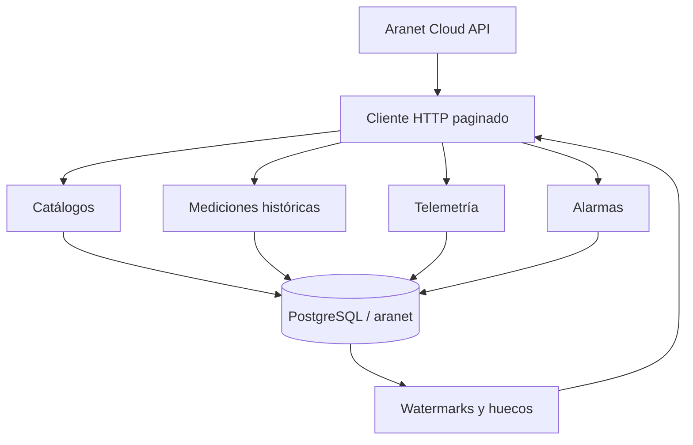

# Aranet Cloud → PostgreSQL

Servicio ETL en Python para extraer metadatos, mediciones, telemetría y alarmas desde
[Aranet Cloud](https://aranet.cloud/openapi/) y almacenarlos de forma idempotente en
PostgreSQL 16.

El proyecto está diseñado para dos cargas diferentes:

1. **Backfill inicial:** recupera el histórico disponible en ventanas pequeñas y paginadas.
2. **Sincronización incremental:** consulta únicamente el periodo reciente con solapamiento;
   es el comando que se programará posteriormente con `cron`.

La API key nunca se guarda en Git. Se lee desde la variable de entorno
`ARANET_API_KEY` o desde un archivo local `.env`, que está excluido mediante `.gitignore`.

## Datos almacenados

- Bases Aranet PRO y configuración disponible.
- Sensores físicos y virtuales, tipos, sondas y capacidades.
- Emparejamientos históricos entre sensores y bases.
- Métricas, unidades y unidades predeterminadas.
- Activos, puntos de medición y asociaciones históricas de sensores.
- Tags y asignaciones.
- Metadata de adjuntos; los archivos binarios no se guardan en PostgreSQL.
- Mediciones ambientales y agrícolas.
- Telemetría técnica: RSSI, batería, alimentación y otras métricas de salud.
- Reglas, alarmas activas e historial de alarmas.
- Watermarks, huecos pendientes y auditoría de cada ejecución.

## Arquitectura



Las tablas `measurement` y `telemetry` están particionadas mensualmente por
`measured_at`. Las particiones se crean automáticamente antes de insertar una página.

Consulta [docs/schema.md](docs/schema.md) para el modelo completo.
La matriz [docs/api-coverage.md](docs/api-coverage.md) enumera los 27 endpoints `GET` de
la especificación y documenta exactamente cuáles se persisten.

## Requisitos

- Python 3.12 o superior.
- PostgreSQL 16. La sintaxis `UNIQUE NULLS NOT DISTINCT` requiere PostgreSQL 15+.
- Acceso HTTPS saliente a `https://aranet.cloud`.
- Para crear la base automáticamente, el usuario PostgreSQL necesita `CREATEDB`.
- `flock` para evitar que dos ejecuciones de cron se superpongan.

## Instalación en Debian

```bash
git clone https://github.com/oscararrise/api_aranet.git
cd api_aranet
python3 -m venv .venv
source .venv/bin/activate
python -m pip install -r requirements.txt
cp .env.example .env
nano .env
```

Variables mínimas:

```dotenv
ARANET_API_KEY=use_a_rotated_key_here
PGHOST=localhost
PGPORT=5432
PGDATABASE=agro_platform
PGUSER=postgres
PGPASSWORD=your_postgres_password
```

No ejecutes `git add -f .env`. Una API key expuesta debe revocarse; eliminarla de un
commit no la vuelve segura.

## Verificaciones iniciales

```bash
python main.py check-api
python main.py init-db
python main.py check-db
```

`check-api` solo muestra cantidades por catálogo. No imprime IDs, nombres, ubicaciones ni
valores medidos.

Si la base ya existe, `init-db` no la modifica destructivamente: crea el esquema `aranet`,
aplica únicamente migraciones pendientes y conserva las demás tablas de `agro_platform`.

### Crear la base sin privilegio `CREATEDB` en el usuario del ETL

Un administrador puede crearla una sola vez:

```bash
sudo -u postgres psql \
  -v target_database=agro_platform \
  -d postgres \
  -f sql/000_create_database.sql
```

Después se otorgan permisos sobre esa base al usuario usado por el proceso.

## Primera carga histórica

```bash
python main.py backfill
```

Por defecto, la fecha inicial se infiere usando el registro más antiguo de las bases,
emparejamientos o asociaciones. Para controlarla explícitamente:

```dotenv
ARANET_BACKFILL_FROM=2025-01-01T00:00:00Z
ARANET_BACKFILL_WINDOW_DAYS=30
```

También puede limitarse una ejecución manual:

```bash
python main.py backfill \
  --from 2026-01-01T00:00:00Z \
  --to 2026-02-01T00:00:00Z
```

El backfill se ejecuta una sola vez. Volver a ejecutarlo no duplica lecturas, pero consume
API, red y tiempo innecesariamente.

## Sincronización incremental

```bash
python main.py sync-incremental
```

El proceso:

1. Lee el último watermark exitoso por endpoint.
2. Retrocede `ARANET_INCREMENTAL_OVERLAP_MINUTES` para recuperar datos tardíos.
3. Consulta cada lote de sensores y sigue todas las páginas.
4. Inserta o actualiza por clave natural.
5. Avanza el watermark solamente cuando todos los lotes terminan correctamente.
6. Registra ventanas fallidas en `aranet.sync_gap`.

Los catálogos se refrescan cada `ARANET_CATALOG_REFRESH_HOURS`, no en cada ejecución de
cron. Esto evita realizar decenas de llamadas de detalle cada pocos minutos.

Una vez por `ARANET_RECONCILIATION_INTERVAL_HOURS`, el proceso relee los últimos
`ARANET_RECONCILIATION_LOOKBACK_DAYS`. Esto captura lecturas antiguas que una base pudo
subir después de recuperar conectividad. Las filas sin cambios no se reescriben, por lo que
la reconciliación evita duplicados y reduce el crecimiento de WAL.

Para reintentar ventanas fallidas:

```bash
python main.py reconcile-gaps --limit 10
```

## Preparación para cron

El repositorio incluye `scripts/run_incremental.sh`. El script usa `flock`, por lo que una
segunda ejecución finaliza sin iniciar otro ETL si el proceso anterior sigue activo.
PostgreSQL añade un advisory lock global para impedir solapamientos incluso si el mismo
proyecto se ejecuta desde otro servidor o sin el wrapper.

Ejemplo para ejecutar cada 10 minutos, **sin instalarlo todavía**:

```cron
*/10 * * * * /opt/api_aranet/scripts/run_incremental.sh >> /opt/api_aranet/logs/cron.log 2>&1
```

No programes `backfill` en cron. Antes de escoger la frecuencia definitiva, compárala con
el intervalo configurado de los sensores. Consultar cada minuto datos que se producen cada
10 minutos solo añade carga.

## Comandos

| Comando | Función |
|---|---|
| `python main.py init-db` | Crea base, esquema, tablas, índices y vistas si faltan |
| `python main.py check-db` | Verifica la conexión PostgreSQL |
| `python main.py check-api` | Verifica autenticación y catálogos Aranet |
| `python main.py sync-catalogs` | Refresca toda la topología y metadata |
| `python main.py backfill` | Recupera el histórico en ventanas |
| `python main.py sync-incremental` | Proceso rápido destinado a cron |
| `python main.py reconcile-gaps` | Reintenta ventanas fallidas |
| `python main.py sync-all` | Backfill si no existe watermark; incremental en adelante |

## Observabilidad

- Log rotativo: `logs/aranet_sync.log`.
- Auditoría: `aranet.sync_run`.
- Watermarks: `aranet.sync_state`.
- Ventanas por reprocesar: `aranet.sync_gap`.
- Exit code `0`: éxito.
- Exit code `1`: configuración, API o base de datos fallida.
- Exit code `130`: interrupción manual.

Los mensajes son filtrados para ocultar `ARANET_API_KEY` y `PGPASSWORD` incluso si una
excepción los incluyera accidentalmente.

## Pruebas

```bash
python -m pip install -r requirements-dev.txt
ruff format --check .
ruff check .
pytest -m "not integration"
```

Las pruebas de integración requieren una instancia PostgreSQL desechable:

```bash
RUN_POSTGRES_TESTS=1 pytest -m integration
```

GitHub Actions levanta PostgreSQL 16 y verifica que las migraciones puedan ejecutarse dos
veces y que los upserts no creen duplicados. La CI utiliza únicamente payloads simulados;
no necesita ni debe recibir la API key real.

## Decisiones importantes

- Se usa `double precision`, no `numeric`, para las series de sensores: evita sobrecoste y
  conserva suficiente precisión para estos dispositivos.
- Los IDs externos se guardan como `text`, aunque algunos parámetros Swagger digan
  `int32`; las respuestas reales los entregan como strings y existen métricas personalizadas.
- `measurements` y `telemetry` son tablas distintas porque representan fenómenos y ciclos
  de retención diferentes.
- Se conserva `raw_payload JSONB` para compatibilidad futura, pero los campos consultados
  frecuentemente están normalizados.
- Las fechas se guardan como `timestamptz` en UTC.
- Los binarios adjuntos no se guardan en PostgreSQL. Si se necesitan, deben copiarse a un
  almacenamiento de objetos como S3 o MinIO.
